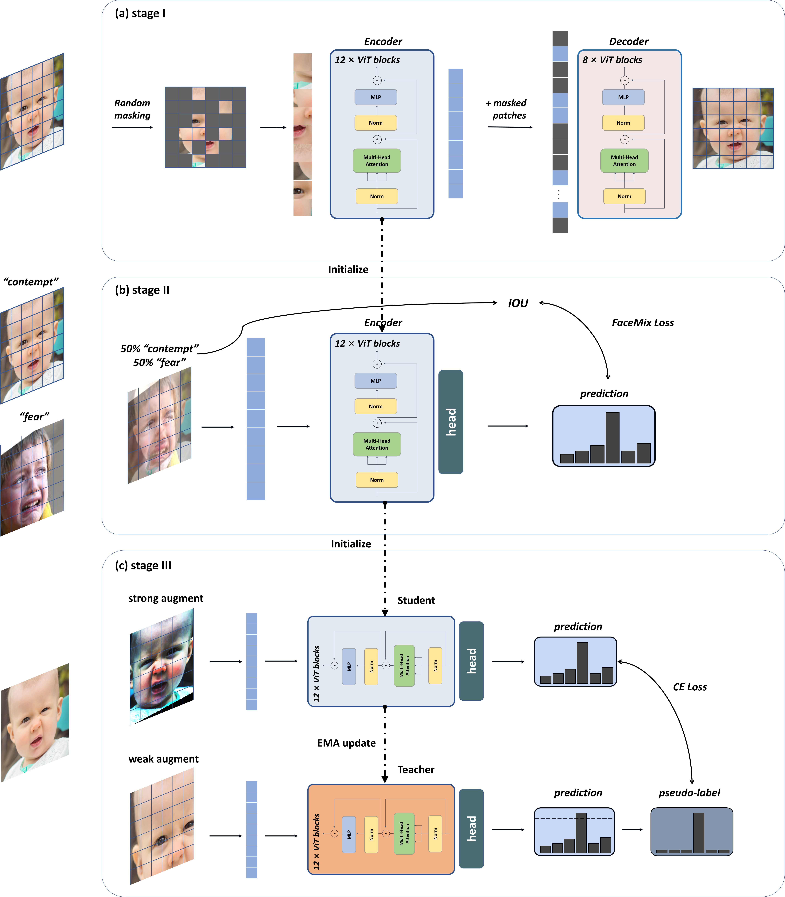

<div align="center">    
 
# Bridging the Gaps: Utilizing Unlabeled Face Recognition Datasets to Boost Semi-Supervised Facial Expression Recognition     


</div>

## Table of Contents
- [Overview](#overview)
- [Dataset](#dataset)
- [Results and Checkpoints](#results-and-checkpoints)
- [Requirements](#requirements)
- [Citation](#citation)
 
## Overview   
This is the official PyTorch implementation of the paper __"Bridging the Gaps: Utilizing Unlabeled Face Recognition Datasets to Boost Semi-Supervised Facial Expression Recognition"__.

<br/>




## Dataset

| Dataset                         | homepage     | train size | test size |
|---------------------------------|--------------|------------|-----------|
| RAF-DB                          | http://www.whdeng.cn/raf/model1.html    | 12271      | 3068|
| FERPlus                         | https://github.com/microsoft/FERPlus    | 287401     | 3500|
| AffectNet-7                     | http://mohammadmahoor.com/affectnet/    | 291651     | 4000|
| AffectNet-8                     | http://mohammadmahoor.com/affectnet/    | 28709      | 7178|


## Results and Checkpoints

Pretrain model weights is available [checkpoints](https://huggingface.co/hfchloe/SSFER/blob/main/125w_base_warmup50_batch256_600.pth)

### Model weights
| Method                          |  Dataset  |    Accuracy  | weights |                                       
|---------------------------------|-----------|--------------|---------|
| SSFER-5%                        |  RAF-DB   |     80.96         |[checkpoints](https://huggingface.co/hfchloe/SSFER/blob/main/SSFER_RAFDB_0.05_model.pth) | 
| SSFER-10%                       |  RAF-DB   |     85.07         |[checkpoints](https://huggingface.co/hfchloe/SSFER/blob/main/SSFER_RAFDB_0.10_model.pth) | 
| SSFER-25%                       |  RAF-DB   |     88.23         |[checkpoints](https://huggingface.co/hfchloe/SSFER/blob/main/SSFER_RAFDB_0.25_model.pth) | 
| SSFER-5%                        |  FERPlus  |     81.77         |[checkpoints](https://huggingface.co/hfchloe/SSFER/blob/main/SSFER_FERPlus_0.05_model.pth) | 
| SSFER-10%                       |  FERPlus  |     83.95         |[checkpoints](https://huggingface.co/hfchloe/SSFER/blob/main/SSFER_FERPlus_0.10_model.pth) | 
| SSFER-25%                       |  FERPlus  |     85.82         |[checkpoints](https://huggingface.co/hfchloe/SSFER/blob/main/SSFER_FERPlus_0.25_model.pth) | 
| SSFER-1%                        |AffectNet-7|     59.08         |[checkpoints](https://huggingface.co/hfchloe/SSFER/blob/main/SSFER_AffectNet7_0.01_model.pth) | 
| SSFER-5%                        |AffectNet-7|     64.02         |[checkpoints](https://huggingface.co/hfchloe/SSFER/blob/main/SSFER_AffectNet7_0.05_model.pth) | 
| SSFER-10%                       |AffectNet-7|     65.37         |[checkpoints](https://huggingface.co/hfchloe/SSFER/blob/main/SSFER_AffectNet7_0.10_model.pth) | 
| SSFER-1%                        |AffectNet-8|     53.85         |[checkpoints](https://huggingface.co/hfchloe/SSFER/blob/main/SSFER_AffectNet8_0.01_model.pth) | 
| SSFER-5%                        |AffectNet-8|     60.17         |[checkpoints](https://huggingface.co/hfchloe/SSFER/blob/main/SSFER_AffectNet8_0.05_model.pth) | 
| SSFER-10%                       |AffectNet-8|     61.65         |[checkpoints](https://huggingface.co/hfchloe/SSFER/blob/main/SSFER_AffectNet8_0.10_model.pth) | 


## Requirements
1. Clone the repository:
 ```bash
 git clone https://github.com/{USERNAME}/{REPO_NAME}.git
 cd SSFER
 ```

2. Create a conda environment and install the required dependencies:
```bash
conda create -n {ENV_NAME} python=3.10
conda activate {ENV_NAME}
pip install -r requirements.txt
```
Finally, these files should be organized as follows:

```text
├── RAF-DB
│   ├── train
│   └── test
├── FERPlus
│   ├── train
│   └── test
├── AffectNet-7
│   ├── train
│   └── test
├── AffectNet-8
│   ├── train
│   └── test
├── outputs_dir
│   ├── SSFER_FERPlus_0.05_model.pth
│   ├── SSFER_FERPlus_0.10_model.pth
│   ├── SSFER_FERPlus_0.25_model.pth
│   ├── SSFER_RAFDB_0.05_model.pth
│   ├── ......
│   ├── SSFER_AffcetNet8_0.01_model.pth
│   ├── SSFER_AffcetNet8_0.05_model.pth
│   ├── SSFER_AffcetNet8_0.10_model.pth
│   ├── 125w_base_warmup50_batch256_600.pth
│   ├── yolov7s-face.pt
├── utils
│   ├── ......
├── MAE_model.py
├── test.ipynb
```

The yolo-face repository used in the article is [here](https://github.com/derronqi/yolov7-face). 


## Citation
```
Bibtex Citation
```