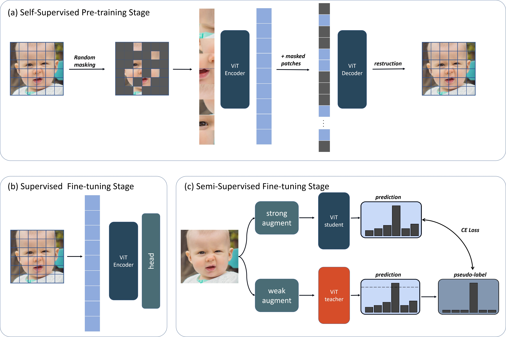

# yolo-face
The yolo-face repository used in the article is [here](https://github.com/derronqi/yolov7-face).

# Training
The pre-training and semi-supervised fine-tuning code will be released immediately after acceptance.

# Testing
We provide the pretrained model [here](https://huggingface.co/hfchloe/SSFER/tree/main).
